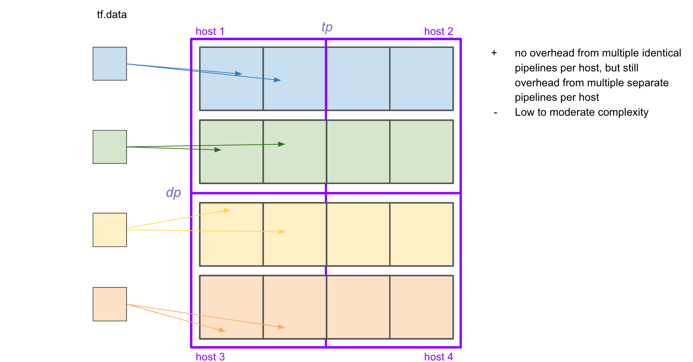
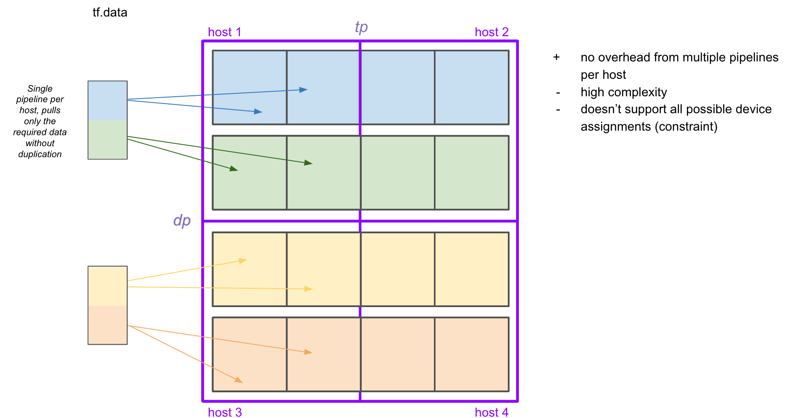

# multihost_dataloading
Experimenting with how best to do multi-host dataloading. Once we determine a recommended option, we will likely upstream it to jax's GDA lib as a function which takes a tf.data.Dataset and a GDA definition, and returns an efficient iterator that returns the desired GDA.

> **Note**
> At present, running this requires using a pod-slice. Set this up using the [following workflow and provided setup script.](https://github.com/sholtodouglas/multihost_dataloading/blob/main/workflow_setup/cloud_tpu_workflow.md)

Install with the following

```
git clone https://github.com/sholtodouglas/multihost_dataloading
cd multihost_dataloading
pip install -e .

python3 multihost_dataloading/tests.py
```

The following diagrams are laid at as below - testing the fully general case with a 32 device pod - where we have both replicas shared across devices, and multiple replicas per device. 


# Methods tested


## All data loaded by all hosts (strawman)


## Per replica data pipeline



## Per host data pipeline



## Data is loaded fully sharded across all devices, and resharded inside pjit (Pax method)


